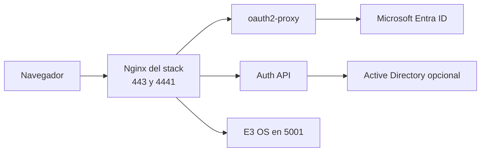

# Arquitectura

## Despliegue soportado

## Roles por listener

- `443`: frente principal de autenticacion y servicios ya publicados con identidad reusable via `/_auth/proxy-identity`
- `4441`: listener dedicado para apps humanas completas que no deben vivir bajo subpath

## Notas de diseno

- `4441` mantiene `auth_request /oauth2/auth` en cada request
- `4441` conserva `Host` y `X-Forwarded-Host` con puerto porque el callback real depende de `:4441`
- el backend de E3 OS en Docker se fija por IPv4 para evitar fallas por resolucion dual-stack
- el loop `/menu -> /auth/login` corresponde a la app E3 OS y no a este stack
