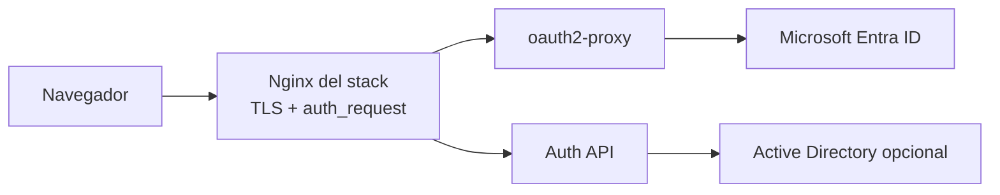
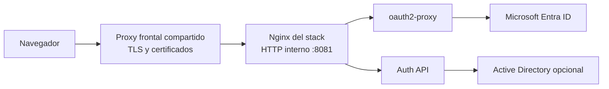

# Arquitectura

## Local / laboratorio

## VM compartida

## Recomendacion

Para una VM Windows Server compartida con varias aplicaciones:

- dejar TLS en el proxy frontal compartido
- publicar este stack en un puerto interno del host, por ejemplo `8081`
- mantener `nginx` del repo como proxy de autenticacion y aplicacion
- operar el repositorio desde `VS Code Remote SSH` sobre la VM

## Como se consume el servicio

- usuarios finales: por la URL publica, por ejemplo `https://e3display.com`
- proxy frontal compartido: reenvia hacia `http://<host-vm>:8081`
- otras aplicaciones del ecosistema: integran contra la URL publica o contra el puerto interno, segun si participan en el flujo humano o en la capa de infraestructura
